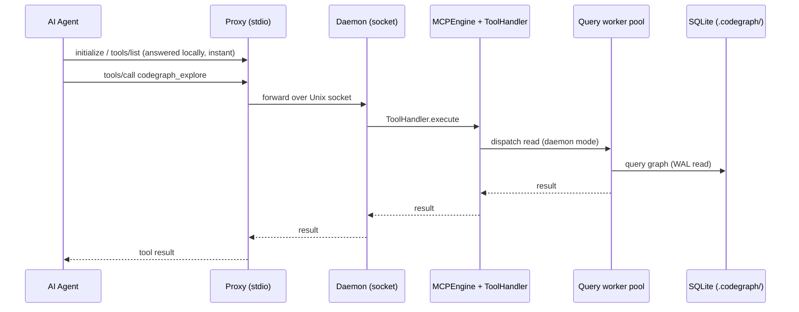

The MCP Server is the primary interface AI coding agents use to query the code graph over the Model Context Protocol. Launched by `codegraph serve --mcp`, it speaks newline-delimited JSON-RPC 2.0 (hand-rolled, no MCP SDK) over stdio, answers the `initialize`/`tools/list`/`tools/call` handshake, and drives the CodeGraph core engine to serve tool results. Its single responsibility is protocol I/O + tool dispatch — all graph intelligence lives in the core engine it wraps.

## Responsibilities
- Serve the MCP JSON-RPC handshake (`initialize`, `tools/list`, `tools/call`, `ping`, plus empty `resources/list` / `prompts/list` probes) over stdio or a Unix-domain socket.
- Return the agent-facing playbook in the `initialize` response — `SERVER_INSTRUCTIONS` when the root is indexed, `SERVER_INSTRUCTIONS_NO_ROOT_INDEX` (pass `projectPath` to a project with a `.codegraph/`) when it is not.
- Advertise the tool surface (`ToolHandler.getTools`) and route each `tools/call` to `ToolHandler.execute`, which drives the shared `CodeGraph` instance.
- Resolve the default project lazily (explicit `--path` → LSP `rootUri`/`workspaceFolders` → client `roots/list` → cwd), and support cross-project queries via each tool's optional `projectPath`.
- Manage three runtime modes — direct (one stdio client), proxy (stdio↔socket pipe), and a detached shared daemon that collapses N clients onto one CodeGraph + watcher + SQLite handle.
- Keep responses fast and non-fatal: reply to `initialize` before heavy init (#172), and return SUCCESS-shaped guidance (never `isError`) for un-indexed / not-found conditions so the agent never learns to abandon the tool.
- Record anonymous `mcp_tool` usage counts after the reply is on the wire, and trigger the opportunistic telemetry flush.

## Tools exposed
Eight tools are defined in `tools.ts` (`export const tools`). `server-instructions.ts` is the single source of truth for agent-facing guidance and, by design, references only `codegraph_explore`. The DEFAULT surface is `codegraph_explore` **alone** — `DEFAULT_MCP_TOOLS = new Set(['explore'])`. Every other tool stays fully functional (handler, library API, and CLI subcommand untouched) but is **not listed** to agents unless re-enabled via the `CODEGRAPH_MCP_TOOLS=explore,node,…` env allowlist (an allowlist replaces the default entirely).

- `codegraph_explore` — PRIMARY tool; one capped call returns the verbatim, line-numbered source of the relevant symbols grouped by file, the call path among them (including synthesized dynamic-dispatch hops), and a blast-radius summary. Query is a natural-language question or a bag of symbol/file names; its description carries a per-repo call budget scaled to indexed file count. **DEFAULT**.
- `codegraph_node` — the after-explore depth tool (framed SECONDARY). Two modes: read a whole file like `Read` (`file` alone, with `offset`/`limit`/`symbolsOnly`), or one named symbol's location/signature/body + caller-callee trail; for an ambiguous name it returns every overload's body in one call. **Gated (allowlist)**.
- `codegraph_search` — quick symbol search by name/kind; returns locations only, no code. **Gated (allowlist)**.
- `codegraph_callers` — lists functions that call a symbol. **Gated (allowlist)**.
- `codegraph_callees` — lists functions a symbol calls. **Gated (allowlist)**.
- `codegraph_impact` — lists symbols affected by changing a symbol (pre-refactor blast radius), `depth`-configurable. **Gated (allowlist)**.
- `codegraph_status` — index health (files / nodes / edges, watcher state). **Gated (allowlist)**.
- `codegraph_files` — indexed file tree with language + symbol counts (tree / flat / grouped). **Gated (allowlist)**.

Surface modifiers: with no default project open (#993), the tool schema marks `projectPath` `required` (a high-salience nudge). On tiny repos (<500 indexed files) the visible surface filters to the core trio `{explore, search, node}` — a no-op under the explore-only default, relevant only when an allowlist is set.

## Request Path (daemon mode)

## Key files
- `src/mcp/index.ts` — `MCPServer` class; picks direct / proxy / daemon mode in `start()`, spawns the detached daemon, installs PPID/liveness watchdogs, kicks the telemetry flush interval.
- `src/mcp/session.ts` — `MCPSession`: per-connection JSON-RPC state machine; picks the instructions variant, resolves the default project, records `mcp_tool` usage.
- `src/mcp/tools.ts` — the 8 tool definitions, `DEFAULT_MCP_TOOLS`, `CODEGRAPH_MCP_TOOLS` allowlist parsing, `getStaticTools`/`getTools`, `getExploreBudget`/`getExploreOutputBudget`, and `ToolHandler.execute`.
- `src/mcp/engine.ts` — `MCPEngine`: shared heavyweight state (CodeGraph instance, file watcher, ToolHandler, query pool); lazy-loads the core off the startup path; catch-up sync gate.
- `src/mcp/server-instructions.ts` — `SERVER_INSTRUCTIONS` + `SERVER_INSTRUCTIONS_NO_ROOT_INDEX`, the single source of truth for agent-facing guidance.
- `src/mcp/transport.ts` — hand-rolled JSON-RPC 2.0: `StdioTransport` and `SocketTransport` over one `JsonRpcTransport` interface.
- `src/mcp/daemon.ts` / `daemon-manager.ts` / `daemon-registry.ts` / `daemon-paths.ts` — detached shared daemon: socket bind, per-connection sessions, client-refcount + idle-timeout reaping, socket-candidate resolution.
- `src/mcp/proxy.ts` — stdio↔socket proxy with local handshake, #277 PPID watchdog, and in-process engine fallback if the daemon never binds.
- `src/mcp/query-pool.ts` / `query-worker.ts` — worker-thread pool so concurrent reads in daemon mode don't serialize on one event loop.
- `src/mcp/liveness-watchdog.ts` / `ppid-watchdog.ts` / `stdin-teardown.ts` — process-lifecycle safety (wedged-main-thread SIGKILL, orphaned-daemon reaping, stdin-close shutdown).

## Dependencies
- **Inbound** — `ai-agent-c` (AI Coding Agent) connects over MCP/stdio and calls `codegraph_explore` (and, when allowlisted, the other tools).
- **Outbound** — drives `core-engine` (the `CodeGraph` class) via `MCPEngine`/`ToolHandler` for every query. Records anonymous `mcp_tool` usage and triggers the flush; the actual HTTP POST to `telemetry-worker` is performed by the shared `src/telemetry` module (opt-out, fire-and-forget), which the MCP server invokes but does not implement.

## Tech Stack
- TypeScript / Node (`>=20 <25`; the daemon path needs `node:sqlite`, so Node ≥22.5). Hand-rolled JSON-RPC 2.0 over newline-delimited stdio/socket — **no `@modelcontextprotocol/sdk` dependency**.
- Node built-ins only for the plumbing: `child_process` (detached daemon spawn), `net` (Unix-domain socket / named pipe), `worker_threads` (query pool), `readline` (stdio framing).
